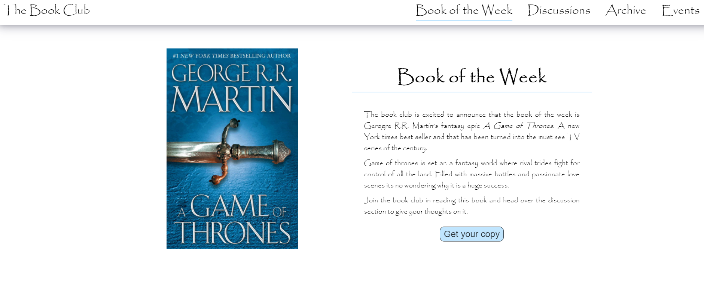
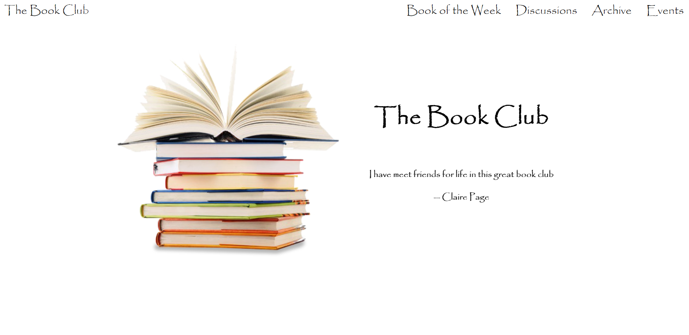
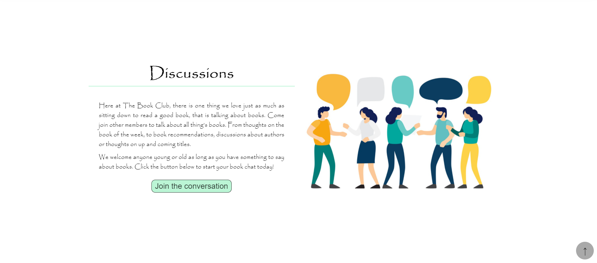

# Landing Page Project

_A gif showing the operation of the final landing page demonstrating some of the key features_

## Description

A fictitious book club webpage that uses HTML, CSS and vanilla Javascript to create an interactive navigational experience for the user.

## Overview

The website provides a simple and clean interface for the user that is responsive to varies desktop / laptop screen sizes. It has the following features:

1. Navigation Bar
2. Header Banner
3. Sections
4. Floating Scroll to top button
5. Footer

The website fades in when it is loaded.

### Navigation Bar

_Screenshot shows the shadow in the nav bar and the **Book of the Week** nav link being highlighted when the section showing on the page is the **Book of the Week**_

---

The navigation bar provides links to the varies section of the webpage on the right and a link to return to the top of the webpage on the left. The links are created dynamically, depending on what sections are in the HTML, using Javascript. Clicking on the navigational link with smoothly scroll the viewport to that section of the webpage.

The navigation bar is fixed to the top of the viewport, when the user scrolls down from the top of the page the navigation bar has a shadow style added to it to distinguish it from the rest of the pages content. When the user hovers over the navigation links a transform effect is used to enlarge the link, to emphasise to the user that their pointer is on that link.

A nav links is highlighted when its correspondind section is displayed on the screen. Each nav link is highlight in a different colour depend on the accent colour of its section.

### Header Banner

_Screenshot shows the header of the webpage designed to clearly identify the pages purpose_

---

The header takes up most of the page when the page first loads. This provides a nice clean introduction to the webpage. It shows what the webpage is for and a opening image of books. The header also includes various quotes about the book club that change and fade in and out using CSS animation and a Javascript event handler.

### Sections

The webpage includes four sections each with:

- An image set using the background image CSS properties
- A text container with:
  - A title
  - Text about that section
  - A button with an action relevant to that section (note the button dont do anything)

Each section has its own accent color for the underline of the title and the button. The button style changes to add a shadow on a hover action. The sections alternate which side the image is on.

When sections are scrolled to for the first time they fade in to view to provide a nice dynamic effect.

### Floating scroll to the top button

_Screenshot shows the **floating scroll to top button** on the bottom right of the screen_

---

A button that when clicked will smoothly scroll the viewport back to the top of the page. This button is fixed to the bottom right of the viewport and only appears after the user has scrolled past the header section. It uses a fade in animation with CSS when it appears. The button will disappear if the user returns to the top of the page.

### Footer

A basic footer than is black to contrast with the white of the rest of the page.
